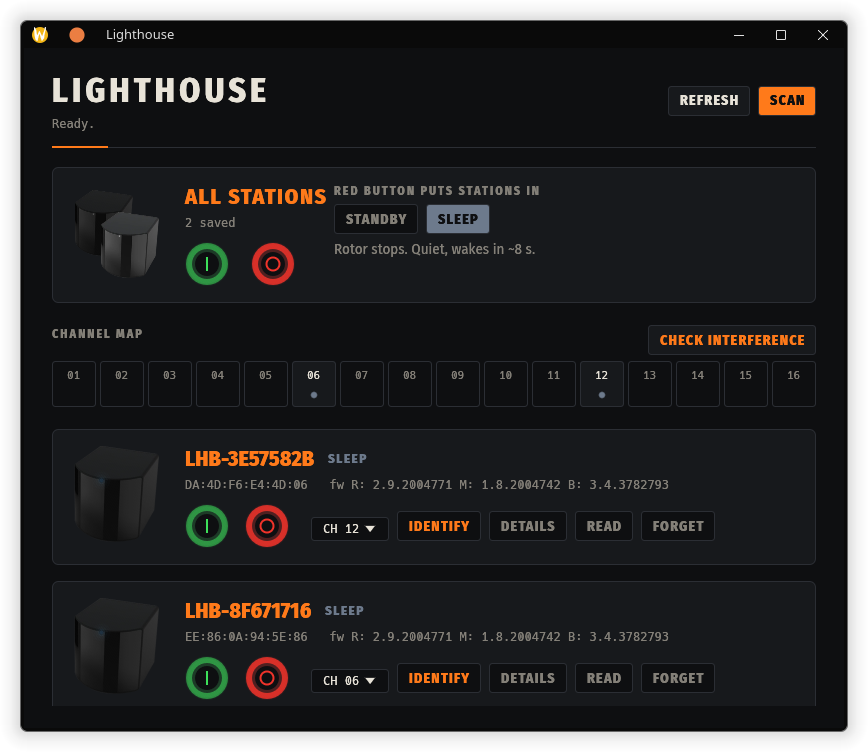

# Lighthouse Management

A native Linux app for managing **SteamVR / Valve Index Base Station 2.0** units over Bluetooth LE: power them on and off, change channels, find channel conflicts and check for interference from other stations nearby. Written in Rust with an [egui](https://github.com/emilk/egui) interface and a full command line.



## Features

- **Power control**: on, standby or sleep, per station or for all at once. The red button's action (sleep or standby) is a setting.
- **Live state**: each card shows a photo of the station whose LED behaves like the real one: solid green when on, a slow blue pulse when asleep or in standby.
- **Channels**: read and set each station's channel (1–16). It is stored on the station and survives power cycles.
- **Channel map**: all 16 channels at a glance. Your stations are filled dots and other stations are rings. Clashes show in red or orange.
- **Interference check**: finds every base station Bluetooth can hear, including neighbours' and other rooms' units. It reads their channels and suggests free channels for yours, which you apply with one click.
- **Identify**: blinks a station's LED so you know which unit is which.
- **Device details**: manufacturer, model, serial number, hardware revision and firmware.
- **Rename** stations (click the name) and **forget** ones you don't use.
- **Command line** for scripts, SteamVR launch hooks and hotkeys.

Only **Base Station 2.0** units (Bluetooth name `LHB-XXXXXXXX`) are supported. 1.0 stations use a different protocol.

## Requirements

- Linux with BlueZ, running as `bluetooth.service`:
  ```sh
  sudo systemctl enable --now bluetooth
  ```
- A Bluetooth 4.0+ adapter. Built-in adapters and most USB dongles work.
- Stations powered and within about 10 m.

No root is needed. BlueZ lets normal desktop users scan and connect.

## Install

### AppImage

```sh
chmod +x Lighthouse_Management-x86_64.AppImage
./Lighthouse_Management-x86_64.AppImage            # opens the app
./Lighthouse_Management-x86_64.AppImage on         # command line works the same
```

To add it to your application menu, copy it to `~/.local/bin/lighthouse` and install the desktop entry (see below), or use a tool such as AppImageLauncher or Gear Lever.

The AppImage is built on a rolling-release distro, so it needs a recent glibc. On older distros, build from source instead.

### From source

Needs a Rust toolchain (`rustup`, Rust 1.85 or newer for edition 2024) and the D-Bus development headers (`dbus` on Arch, `libdbus-1-dev` on Debian and Ubuntu, `dbus-devel` on Fedora).

```sh
cargo install --path .
install -Dm644 lighthouse.desktop ~/.local/share/applications/lighthouse.desktop
install -Dm644 assets/icon.png ~/.local/share/icons/hicolor/512x512/apps/lighthouse.png
gtk-update-icon-cache -f -t ~/.local/share/icons/hicolor   # refresh a stale icon cache, if you have one
```

The binary goes to `~/.cargo/bin/lighthouse`. Make sure that directory is on your `PATH`.

### Building the AppImage

Needs [`appimagetool`](https://github.com/AppImage/appimagetool) on `PATH`.

```sh
./packaging/appimage.sh      # writes Lighthouse_Management-x86_64.AppImage in the repo root
```

## Using the app

Run `lighthouse` with no arguments, or launch **Lighthouse Management** from your application menu.

On first launch the app scans for 6 seconds and saves every station it finds. After that it loads your saved stations and reads their state straight away.

| Control | What it does |
| --- | --- |
| **SCAN** | Look for stations again and add any new ones. |
| **REFRESH** | Re-read power, channel and device info for every station. |
| **All stations: green I / red O** | Power every station on, or put every station in the "off" mode. |
| **Red button puts stations in** | Choose what the red button does. **Sleep** stops the rotor (silent, wakes in about 8 s). **Standby** keeps it spinning with the lasers off (wakes in about 2 s). |
| **Channel map** | Channels 1–16. Hover over a cell to see which stations use it. |
| **CHECK INTERFERENCE** | Survey all stations in Bluetooth range and suggest channels (see below). |
| **Station: green I / red O** | Power that one station on or off. |
| **CH ▾** | Set that station's channel. |
| **IDENTIFY** | Blink that station's LED. |
| **DETAILS** | Show the name, address, mode, channel, manufacturer, model, serial, hardware and firmware. |
| **READ** | Re-read this station only. |
| **FORGET** | Remove it from the list. Scan to bring it back. |
| **Station name** | Click to rename. Enter saves and Escape cancels. |

### Channels and interference

Each base station sweeps the room with infrared light on one of 16 channels (sync modes). Trackers and headsets tell stations apart by channel, so **every station a headset can see must be on a different channel**. That includes a neighbour's station shining through a window or an open door.

- A channel used by two of your own stations turns **red** in the map. A **Suggested channels** box then offers to move one of them.
- **CHECK INTERFERENCE** listens for every base station in Bluetooth range (about 8 s) and connects to each one that isn't yours to read its channel. Channels used by other stations turn **orange** when yours share them, and the suggestions move your stations away from them, starting with the closest ones by signal strength.
- **APPLY** writes the suggested channels. Stations keep their current channel whenever it's already clear, so nothing moves without a reason.

The check is limited by what a PC can see: Bluetooth range is roughly the same as optical range, but the app can't measure the infrared light itself. A station that Bluetooth can't hear won't appear, and signal strength is only a rough guide to distance. After changing channels, restart SteamVR so it picks up the new ones.

## Command line

```
lighthouse                                   open the app
lighthouse scan                              find stations and save them
lighthouse status [ADDR...]                  power state, channel and device info
lighthouse on|off|standby|sleep|toggle [ADDR...]
                                             change power (off = sleep or standby, set in the app)
lighthouse channel ADDR 1-16                 set the channel (optical sync mode)
lighthouse survey                            read nearby stations' channels, suggest free ones
lighthouse identify ADDR                     blink the front LED
lighthouse help
```

Without `ADDR`, commands act on every saved station, and scan first if none are saved yet. Stations are handled in parallel. Power commands wait until each station reports the new state, which takes up to 15 s when waking from sleep.

Old `--on` / `--sleep` / `--standby` flags still work.

Exit codes: `0` success, `1` a station failed or none were found, `2` bad usage or Bluetooth unavailable.

### Examples

```sh
lighthouse on                                  # wake everything before starting SteamVR
lighthouse off                                 # sleep or standby, per the app setting
lighthouse toggle                              # one hotkey for both
lighthouse status DA:4D:F6:E4:4D:06
lighthouse channel EE:86:0A:94:5E:86 3
lighthouse survey
```

### Power stations with SteamVR

Wrap SteamVR's launch options in Steam (SteamVR > Properties > Launch Options):

```
lighthouse on; %command%; lighthouse off
```

Or bind `lighthouse toggle` to a keyboard shortcut in your desktop's settings.

## Files

| Path | Contents |
| --- | --- |
| `~/.config/lighthouse-control/devices.json` | Saved stations as `{"AA:BB:CC:DD:EE:FF": "name"}`. Same format as the older Python script, so existing lists carry over. |
| `~/.config/lighthouse-control/off-mode` | `sleep` or `standby`, the red button's action. |

`$XDG_CONFIG_HOME` is used instead of `~/.config` when it is set.

## Troubleshooting

**"Scan failed … Is bluetooth.service running?"** Start it with `sudo systemctl enable --now bluetooth` and check that your adapter is not blocked: `rfkill list`, then `rfkill unblock bluetooth` if needed.

**No stations found.** Make sure they have power (the LED is lit or pulsing) and are within range. Close SteamVR's own base station power management and any phone app that might be connected: a station accepts only one Bluetooth connection at a time.

**A station shows an error or "not in range".** Press **READ** to retry. Each command connects, retries up to 3 times, then disconnects. A station that has just been unplugged can take a few seconds to advertise again.

**The app shows a blank "?" icon in the menu or taskbar.** An old `~/.local/share/icons/hicolor/icon-theme.cache` is hiding the new icon. Run `gtk-update-icon-cache -f -t ~/.local/share/icons/hicolor`, then log out and back in (or restart Plasma).

**The window shows a FPS/GPU overlay.** That is MangoHud enabled system-wide. Run `MANGOHUD=0 lighthouse`.

## Protocol

Base Station 2.0 control service `00001523-1212-efde-1523-785feabcd124`:

| Characteristic | UUID | Use |
| --- | --- | --- |
| Power | `00001525-1212-efde-1523-785feabcd124` | Write `0x00` sleep, `0x01` on, `0x02` standby. Reads back `0x00` sleep, `0x02` standby, `0x08` booting, and `0x01`/`0x09`/`0x0b` on. |
| Channel | `00001524-1212-efde-1523-785feabcd124` | Read/write one byte, 1–16. |
| Identify | `00008421-1212-efde-1523-785feabcd124` | Write `0x00` to blink the LED. |

Device details come from the standard Device Information service (`0x2a24`–`0x2a29`).

Thanks to the projects this is based on: [lighthouse_pm](https://github.com/jeroen1602/lighthouse_pm), [svrbsctl](https://github.com/chenxiaolong/svrbsctl), [libsurvive's bsd_ctrl](https://github.com/collabora/libsurvive), [lighthouse-v2-manager](https://github.com/nouser2013/lighthouse-v2-manager) and BenWoodford's GATT notes.

## Development

```sh
cargo run                       # app
cargo run -- status             # CLI
cargo test                      # power-state decoding and channel planner
cargo clippy --all-targets -- -D warnings
```

| File | Contents |
| --- | --- |
| `src/ble.rs` | Bluetooth protocol, channel planner, saved settings |
| `src/ui.rs` | egui interface and the background Bluetooth worker |
| `src/main.rs` | Command line |
| `assets/` | Station photo, app icon, Fira Sans Condensed (SIL OFL 1.1, see `assets/OFL.txt`) |
| `packaging/appimage.sh` | AppImage build |

## License

No license chosen yet. The bundled Fira Sans fonts are under the SIL Open Font License (`assets/OFL.txt`).
